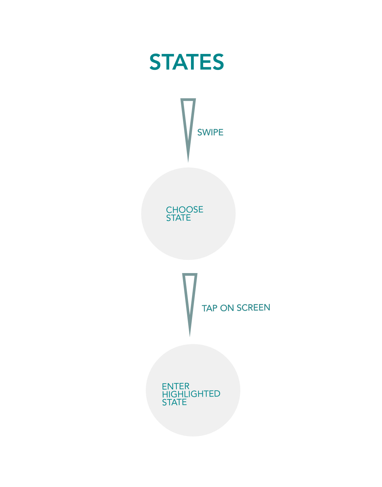

# ThesisApp

This project was generated with [Angular CLI](https://github.com/angular/angular-cli) version 8.2.0.

## Development server

Run 'batch.command' file or 'socket-server/node index.js' then 'thesis-app/ng serve --host 0.0.0.0 -o'  and finally (Mac) 'open -a Google\ Chrome --args --disable-web-security --user-data-dir' or (Windows) 'chrome.exe --user-data-dir="C://Chrome dev session" --disable-web-security' . Then naviugate to `http://localhost:4200/` on desktop and 'YourIP:4200' on mobile.

## Configurable

    timeline.json: Information about past destinations. City, Country, Date and your resources
    upcoming.json: Information about future destination. Flights, dates etc.
    times.json: Timings(Image Slideshow & InfoBubble)

## Guide

## Code scaffolding

Run `ng generate component component-name` to generate a new component. You can also use `ng generate directive|pipe|service|class|guard|interface|enum|module`.

## Build

Run `ng build` to build the project. The build artifacts will be stored in the `dist/` directory. Use the `--prod` flag for a production build.

## Running unit tests

Run `ng test` to execute the unit tests via [Karma](https://karma-runner.github.io).

## Running end-to-end tests

Run `ng e2e` to execute the end-to-end tests via [Protractor](http://www.protractortest.org/).

## Further help

To get more help on the Angular CLI use `ng help` or go check out the [Angular CLI README](https://github.com/angular/angular-cli/blob/master/README.md).

